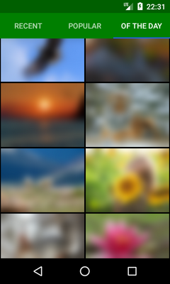

# YaPhotos

Sample Android app to demonstrate usage of Yandex.Fotki API.

Displays three public photo albums: "Recent photos", "Popular photos" and "Photos of the day".

This is a version of [YaPhotosNoLib](https://github.com/gmk57/ya-photos-no-lib) with third-party libraries and more features.

    

## Features

- Album view:
  - Swipe and tab navigation
  - App bar scrolling off-screen
  - Pull to refresh
  - Thumbnails caching and preloading (with lower priority)
  - Endless scrolling
  - Thumbnail size and column number auto-adjusted to screen size
  - Progress and error indicators
- Detail view:
  - Swipe navigation
  - Fullscreen mode
  - Share button
  - Link to web page
  - Endless scrolling
  - Thumbnail preview while loading full-size image
  - Image size auto-adjusted to screen size
  - Progress and error indicators
- Multi-layer model repository (memory/database/network)
- Persistence for better offline UX
- Workaround to calculate next page for "Photos of the day" album
- Instrumentation and unit tests

## Technologies used

- [Dagger](https://google.github.io/dagger/)
- [EventBus](http://greenrobot.org/eventbus/)
- [Glide](http://bumptech.github.io/glide/) with RecyclerViewPreloader
- [greenDAO](http://greenrobot.org/greendao/)
- [Gson](https://github.com/google/gson) with custom TypeAdapter
- [Parceler](http://parceler.org/)
- [Retrofit](http://square.github.io/retrofit/)
- [Robolectric](http://robolectric.org/)
- AsyncTask
- AtomicBoolean, AtomicReferenceArray
- CoordinatorLayout, AppBarLayout, Toolbar, TabLayout
- Date, Calendar, SimpleDateFormat
- FileProvider
- Fragment, FragmentManager
- JUnit, Espresso, UI Automator
- RecyclerView, GridLayoutManager
- StrictMode
- SwipeRefreshLayout
- Thread
- ViewPager, FragmentStatePagerAdapter, FragmentPagerAdapter
- WebView

## Installation

This is an Android Studio project.

## License

Project is distributed under MIT license.

Third-party libraries are distributed under their own terms, please see their websites & repositories.

The use of Yandex.Fotki service and its API is regulated by [API User Agreement](https://yandex.ru/legal/fotki_api/), [Yandex.Fotki Service Terms Of Use](https://yandex.ru/legal/fotki_termsofuse/) and general [User Agreement for Yandex Services](https://yandex.com/legal/rules/).

All photos are exclusive property of their right holders, available for personal non-commercial use under certain conditions (see links above).
